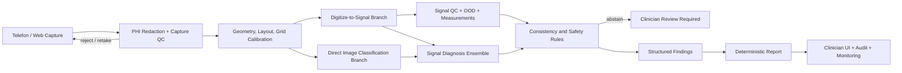

# Corio ECG Profesyonelleşme Değerlendirmesi

**Tarih:** 13 Haziran 2026
**Kapsam:** Araştırma prototipinden, PMcardio benzeri yüksek güvenilirlikli klinik karar destek ürününe geçiş
**Durum:** Stratejik teknik ve klinik değerlendirme; tıbbi veya hukuki görüş değildir

## 1. Yönetici Özeti

Corio ECG bugün çalışan ve ölçülebilen bir **araştırma prototipidir**. ECGFounder
entegrasyonu upstream uygulamayla birebir doğrulanmış, görüntüden sinyale dönüşüm
çalışmakta, sentetik ve eşleşmiş referanslı değerlendirmeler kurulmuş, gerçek telefon
fotoğrafları için operasyonel test akışı geliştirilmiştir. Bu, projenin en güçlü yanıdır:
başarı ile doğruluk arasındaki fark belgelerde açıkça ayrılmıştır.

Proje henüz yüksek doğrulukla tanı koyan klinik bir araç değildir. Ana engel daha büyük
bir sınıflandırıcı eğitmek değil; hatalı girdileri güvenle reddetmek, fotoğraf ile gerçek
sinyal arasındaki klinik açıdan önemli morfolojiyi korumak, desteklenen her tanıyı yeterli
örnekle dış merkezlerde doğrulamak, ölçüm ve rapor motorunu kurmak ve tıbbi cihaz kalite
sistemini geliştirme sürecine yerleştirmektir.

**Önerilen ürün stratejisi:** İlk klinik ürün 150 tanı vadetmemelidir. Yetişkin, istirahat
halinde çekilmiş standart 12 derivasyonlu ECG; belirli kağıt düzenleri; desteklenen çekim
koşulları; 12-20 iyi doğrulanmış bulgu; açık kalite reddi; hekim karar desteği şeklinde
dar bir kullanım amacıyla başlamalıdır. Kapsam ancak bağımsız kanıt oluştukça genişlemelidir.

**Gerçekçi zaman ufku, planlama tahmini:**

| Hedef | Süre | Temel şart |
|---|---:|---|
| Güvenilir araştırma platformu | 6-9 ay | Eşleşmiş gerçek fotoğraf verisi, CI/MLOps, dış kalite kapısı |
| Kontrollü klinisyen pilotu | 12-18 ay | Kilitlenmiş model, çok merkezli retrospektif ve sessiz prospektif test |
| CE/Türkiye pazara hazırlık | 18-30+ ay | QMS, teknik dosya, klinik değerlendirme, onaylanmış kuruluş |

## 2. Mevcut Durumun Kanıta Dayalı Özeti

### 2.1 Doğrulanmış Güçlü Yönler

- ECGFounder yerel uygulaması aynı checkpoint ve girdide upstream logits ile tam eşleşiyor.
- PTB-XL test fold değerlendirmesi tekrarlanabilir ve ham model olasılıklarını ölçüyor.
- Digitizasyon başarısı, sinyal fidelity, tanı doğruluğu ve tanı drift'i ayrı metrikler.
- PMcardio ECG Image Database üzerinde görüntü-sinyal eşleşmeli benchmark mevcut.
- Fiziksel bozulma kategorileri ayrı raporlanıyor; bent/crumpled zayıflığı görünür.
- Segment-aware deney, kağıt üzerindeki ardışık zaman segmentleri sorununu göstermiştir.
- Gerçek telefon fotoğrafı akışı subprocess, timeout, hash ve audit kayıtları kullanıyor.
- Kalite kapısının ilk yorumlanabilir sürümü ve accept/warn/reject modeli geliştirilmiştir.
- Test paketi 13 Haziran 2026 denetiminde `149 passed, 1 skipped` sonucunu verdi.

### 2.2 Mevcut Sayısal Gerçekler

| Alan | Mevcut sonuç | Doğru yorum |
|---|---:|---|
| PTB-XL official macro AUROC | `0.8679` | Sinyal model entegrasyonu çalışıyor; klinik ürün doğruluğu değildir |
| PTB-XL official macro F1 | `0.3673` | Tek `0.5` threshold, sınıf dengesizliği ve etiket desteği yetersiz |
| Official değerlendirilebilir sınıf | `31 / 150` | 150 sınıfın çoğu için bu testte yeterli pozitif destek yok |
| PMcardio görüntü başarı oranı | `70 / 70` | Extraction başarısı; doğru sinyal veya doğru tanı anlamına gelmez |
| PMcardio median korelasyon | `0.823` | Genel şekil umut verici, kategori ve kayıt bazında ciddi sapma var |
| PMcardio median SNR | `3.83 dB` | Profesyonel digitizasyon hedefi için düşük |
| Bent / crumpled median korelasyon | `0.280 / 0.423` | Bu koşullar mevcut sürümde güvenle tanı akışına alınamaz |
| Tiled / segment ensemble cosine | `0.894 / 0.924` | Zaman yapısını dikkate almak faydalı; tanı doğruluğu kanıtı değildir |
| Gerçek fotoğraf, eşleşmiş referans | `0 kayıt` | Gerçek dünya doğruluğu ölçülmemiştir |
| Kalite kapısı reject recall | `81.8%` | `22` kötü kaydın `4` tanesi reddedilmemiştir |
| Kalite kapısı dış doğrulama | Yok | Aynı 70 görüntüde geliştirme ve değerlendirme yapılmıştır |

Yerel kanıt kaynakları:
[MEMORY.md](../MEMORY.md),
[evaluation-methodology.md](../evaluation-methodology.md),
[phase2-academic-findings.md](../phase2-academic-findings.md) ve
[next-priorities.md](../plans/2026-06-13-next-priorities.md).

## 3. Olgunluk Denetimi

| Boyut | Seviye | Ana açık |
|---|---:|---|
| Araştırma sorusu ve benchmark disiplini | 3.5/5 | Daha büyük dış set ve önceden kayıtlı protokol |
| Digitizasyon | 2.5/5 | Fiziksel bozulma, layout, zaman ve amplitüd güvenilirliği |
| Sinyal tanı modeli | 2/5 | Sınıf desteği, kalibrasyon, dış doğrulama, belirsizlik |
| Klinik ölçüm motoru | 0.5/5 | PR/QRS/QT/QTc/aks/ST ölçümleri ve beat annotation yok |
| Rapor motoru | 0.5/5 | Şablon var; deterministic rapor ve doğrulama yok |
| VT/SVT uzmanlığı | 0/5 | Modül boş; uygun gold-standard veri yok |
| Ürün/backend/mobil | 1/5 | Gradio demo var; API, auth, vaka yönetimi, audit yok |
| MLOps ve tekrarlanabilirlik | 1.5/5 | Pinned external commit var; lockfile/container/registry/CI yok |
| Güvenlik ve mahremiyet | 0.5/5 | PHI yasaklanmış; ürün güvenlik mimarisi yok |
| Regülasyon ve kalite sistemi | 0/5 | Intended use, QMS, risk dosyası, teknik dosya yok |

## 4. Kod ve Operasyon Denetimi

### 4.1 İyi Uygulamalar

- Model parity testi, hash tabanlı audit ve frozen baseline yaklaşımı doğrudur.
- Kritik değerlendirme akışlarında subprocess izolasyonu ve timeout kullanılması değerlidir.
- Open-ECG-Digitizer ve ECG-Image-Kit revizyonları pinlenmiştir.
- Veri/model dosyaları git dışında tutulmaktadır.

### 4.2 Profesyonel Ürün İçin Kapatılması Gereken Açıklar

- `src/pipeline/report.py`, training pipeline ve `src/vtsvt/` uygulaması yoktur.
- CI workflow, Docker image, dependency lockfile ve kesin proje lisansı yoktur.
- API, kimlik doğrulama, rol bazlı yetki, veritabanı, vaka audit trail ve monitoring yoktur.
- Repo genelinde `31` Ruff ve `30` mypy hatası vardır.
- Projenin kendi 250 satır kuralı birçok dosyada ihlal edilmiştir; `digitize.py` 1.000+ satırdır.
- `pyproject.toml` alt sınır kullanıyor ancak üst sınır/lockfile yok; yeniden kurulum drift riski taşır.
- Vast kurulum scriptleri floating paketler, `git pull`, geniş yetkiler ve kalıcı artifact stratejisi kullanır.
- Gradio `0.0.0.0:7860` üzerinde auth olmadan açılabilir; klinik veriyle bu kabul edilemez.
- UI kalite kapısını tanı gösteriminden önce zorunlu uygulamamaktadır.
- Tek global z-score, amplitüd tabanlı LVH/ST/low-voltage görevleri için bilgi kaybı riski taşır.
- Tanı UI'sındaki kalp hızı heuristikleri resmi model benchmark yolundan farklıdır ve ayrı doğrulanmalıdır.
- Mevcut kağıt segmentlerini tekrar ederek/tileyerek 10 saniyeye genişletmek fizyolojik olarak gerçek
  simultane 12-lead kayıt üretmez.

## 5. PMcardio Seviyesi Gerçekte Ne Gerektirir?

PMcardio'nun kamuya açık ürün konumlandırması CE sertifikası, fotoğraf veya ekran girdisi,
50+ bulgu ve çok sayıda klinik çalışma vurgular. Bu sayıların bir kısmı üretici beyanıdır ve
ürün hedefi olarak değil, ürünleşme kapsamının göstergesi olarak okunmalıdır
([Powerful Medical](https://www.powerfulmedical.com/)).

Bağımsız birinci basamak çalışmasında 290 hastada majör ECG anormallikleri için duyarlılık
`%86`, özgüllük `%92`; AF için duyarlılık `%97`, özgüllük `%99` raporlanmıştır
([AMSTELHEART-1](https://pubmed.ncbi.nlm.nih.gov/37351331/)). Bu örnek, ürün seviyesinin
yalnız model AUROC'u değil, gerçek kullanım ortamı, telefon platformları ve klinik referans
standartla doğrulama olduğunu gösterir.

Corio ECG'nin PMcardio benzeri seviyeye çıkması için şu yeteneklerin birlikte bulunması gerekir:

1. Desteklenen ve desteklenmeyen girdiyi açıkça tanımlayan capture kalite sistemi.
2. Klinik morfolojiyi ve amplitüdü koruyan güvenilir digitizasyon.
3. Sınıf bazlı doğrulanmış tanı modelleri ve belirsizlik/abstention.
4. Hesaplanabilir ECG ölçümleri ve klinik kurallarla tutarlılık denetimi.
5. Hekime yönelik açıklanabilir, yapılandırılmış ve audit edilebilir rapor.
6. Bağımsız, çok merkezli ve prospektif klinik kanıt.
7. Tıbbi cihaz kalite, risk, güvenlik ve değişiklik yönetimi sistemi.

## 6. Önerilen İlk Ürün Tanımı

### 6.1 Önerilen Intended Use Taslağı

> Corio ECG, yetişkin hastalara ait standart istirahat 12 derivasyonlu ECG kağıt çıktısı
> veya desteklenen dijital görüntülerden kalite kontrollü ECG ölçümleri ve ön tanı önerileri
> oluşturan, eğitimli sağlık profesyonellerine yönelik karar destek yazılımıdır. Tek başına
> kesin tanı veya acil tedavi kararı vermek için kullanılmaz.

Bu metin regülasyon uzmanı ve kardiyoloji klinik lideri tarafından yeniden yazılmalıdır.

### 6.2 V1 Dahil

- Yetişkin, 10 saniyelik, 12 derivasyonlu istirahat ECG.
- Öncelikle `3x4+1R` ve `6x2+1R`; bilinen hız ve gain.
- Düz kağıt tarama ve iyi çekilmiş telefon fotoğrafı.
- Kalite reddi ve yeniden çekim rehberi.
- İlk 12-20 bulgu: ritim, hız, AF/flutter, bradi/takikardi, PVC/PAC, RBBB/LBBB,
  AV blok, QRS genişliği, QT/QTc, aks, LVH ve açık ST/T anormallikleri.
- Yapılandırılmış ölçüm + olasılık + belirsizlik + kalite uyarısı.

### 6.3 V1 Hariç

- Pediatrik ECG, Holter, egzersiz ECG, tek derivasyon wearable.
- Bent/crumpled/örtülü kağıt, düşük çözünürlük ve desteklenmeyen layout.
- Otonom STEMI/OMI, VT/SVT veya tedavi yönlendirmesi.
- LLM'nin yeni klinik bulgu üretmesi.
- Canlı ortamda kendini güncelleyen model.

## 7. Hedef Teknik Mimari

### Mimari İlkeler

- **Çift yol:** Digitizasyon+sinyal modeli yanında doğrudan görüntü sınıflandırma modeli;
  uyuşmazlık güven sinyali olarak kullanılmalı.
- **Ölçüm önce:** PR/QRS/QT/QTc, aks, ST seviyesi, R-peak ve beat kalitesi ayrı motor olmalı.
- **LLM en sonda:** LLM yalnız doğrulanmış yapılandırılmış JSON'u dilsel rapora çevirmeli;
  tanı veya ölçüm üretmemeli.
- **Üç ayrı belirsizlik:** görüntü kalitesi, sinyal rekonstrüksiyonu ve tanı belirsizliği ayrı
  hesaplanmalı ve UI'da ayrı gösterilmeli.
- **Abstention:** Model her vakaya cevap vermek zorunda olmamalı. ECG sınıflandırmasında
  belirsizlik yöntemlerinin kalibrasyon ve OOD davranışı için değeri gösterilmiştir
  ([European Heart Journal study](https://pmc.ncbi.nlm.nih.gov/articles/PMC9707930/)).
- **Human-in-the-loop:** Klinik ürünün başarı metriği tek başına AI değil, hekim+AI ekibidir.

## 8. Veri ve Klinik Kanıt Stratejisi

### 8.1 Veri Katmanları

| Katman | Amaç | Önerilen ölçek, planlama tahmini |
|---|---|---:|
| Açık dijital sinyal | Pretraining/fine-tuning | PTB-XL + kontrollü MIMIC-IV-ECG subset |
| Sentetik görüntü | Sistematik bozulma ve ablation | 100 binlerce varyant |
| Fiziksel eşleşmiş görüntü | Digitizasyon ve quality gate | İlk gate 1.000+, ürünleşme 10.000+ görüntü |
| Klinik etiketli fotoğraf | Uçtan uca tanı doğrulama | Çok merkezli, binlerce ardışık vaka |
| Kritik/enriched kohort | VT, OMI, yüksek derece blok | Ayrı gold-standard ve prevalans düzeltmesi |

PTB-XL 21.799 ECG ve 71 statement içerir
([PhysioNet](https://physionet.org/content/ptb-xl/)). MIMIC-IV-ECG yaklaşık 800.000 ECG ve
160.000 hastayı kapsar; erişim, kullanım koşulları ve hasta-bazlı split zorunludur
([PhysioNet](https://physionet.org/content/mimic-iv-ecg/1.0/)). MIMIC'i eklemek otomatik
olarak doğruluk artırmaz; etiket kaynağı, cihaz, popülasyon ve domain farkı yönetilmelidir.

### 8.2 Gold Standard

- Her klinik vaka en az iki bağımsız ECG okuyucusu tarafından etiketlenmeli.
- Kritik veya uyuşmaz vakalar üçüncü uzman/adjudication paneline gitmeli.
- VT/SVT için basit ECG statement yeterli değildir; ritim şeridi, klinik bağlam ve mümkünse
  elektrofizyoloji/tedavi sonucu gibi güçlü referans gerekir.
- OMI/STEMI için yalnız ECG etiketi değil, anjiyografi, troponin, klinik seyir ve uzman karar
  standardı gerekir.
- Etiket ontolojisi SCP-ECG/SNOMED CT ile versiyonlanmalı; belirsiz ve eksik etiket tutulmalı.

### 8.3 Split ve Değerlendirme

- Hasta, kurum, cihaz/printer ve zaman bazlı sızıntısız split.
- Development, internal locked test ve tamamen bağımsız external test ayrımı.
- Sınıf başına support, AUROC, AUPRC, sensitivity, specificity, PPV, NPV, F1, kalibrasyon,
  decision curve ve abstention coverage-risk raporu.
- Yaş, cinsiyet, cihaz, kurum, layout, çekim telefonu, ışık ve kalite alt grupları.
- Confidence interval ve önceden belirlenmiş kabul kriterleri.
- Negatif sınıfların baskın olduğu “threshold agreement” tek başına başarı metriği olamaz.

## 9. Regülasyon, Kalite ve Güvenlik

### 9.1 Avrupa Birliği ve Türkiye

Tanı kararını bilgilendiren yazılım MDR Rule 11 kapsamına girer. Güncel MDCG örneği,
heartbeat analiz edip hekime anormallik bildiren mobil uygulamayı, tanıyı yönlendirdiğinde
Class IIb örneği olarak verir
([MDCG 2019-11 rev.1, s.34](https://health.ec.europa.eu/document/download/b45335c5-1679-4c71-a91c-fc7a4d37f12b_en)).
Corio ECG'nin STEMI/VT gibi kullanım amaçları IIb veya kullanım amacına göre daha yüksek
risk değerlendirmesine yol açabilir. Nihai sınıf, intended use ve regülasyon danışmanı/onaylanmış
kuruluş ile belirlenmelidir.

Türkiye tıbbi cihaz düzeni AB MDR ile yakından uyumludur; CE, teknik dosya, klinik değerlendirme,
ÜTS ve yerel yükümlülükler baştan planlanmalıdır. AI Act'in regüle ürünlere gömülü yüksek riskli
AI kuralları için resmi AB sayfası 2 Ağustos 2028 geçişini belirtmektedir; mevzuat halen değiştiği
için düzenli hukuki takip gerekir
([European Commission](https://digital-strategy.ec.europa.eu/en/policies/regulatory-framework-ai)).

### 9.2 ABD

Bu ürünün black-box ECG yorumlaması, hekimin temeli bağımsız inceleyebilmesi şartı nedeniyle
çoğu senaryoda basit “non-device CDS” sayılmayacaktır; FDA cihaz yazılımı yolu beklenmelidir.
Predicate analizi sonrası 510(k) veya De Novo stratejisi regülasyon uzmanıyla belirlenmelidir.
FDA, AI cihazlarda tüm yaşam döngüsü yaklaşımını ve GMLP prensiplerini vurgular
([FDA AI/SaMD](https://www.fda.gov/medical-devices/software-medical-device-samd/artificial-intelligence-software-medical-device),
[GMLP](https://www.fda.gov/medical-devices/software-medical-device-samd/good-machine-learning-practice-medical-device-development-guiding-principles)).

### 9.3 Başlangıçtan Uygulanacak Standartlar

- ISO 13485: kalite yönetim sistemi.
- ISO 14971 ve yeni ML rehberleri: risk yönetimi.
- IEC 62304: yazılım yaşam döngüsü.
- IEC 62366-1: kullanılabilirlik ve kullanım hataları.
- IEC 82304-1: sağlık yazılımı ürün güvenliği.
- IEC 81001-5-1 / FDA cybersecurity guidance: güvenli geliştirme ve post-market güvenlik.
- IMDRF SaMD clinical evaluation: valid clinical association, analytical/technical validation,
  clinical validation
  ([IMDRF](https://www.imdrf.org/documents/software-medical-device-samd-clinical-evaluation)).

### 9.4 Mahremiyet ve Güvenlik

- Ürün gerçek ECG fotoğrafında PHI bulunacağını varsaymalıdır; “repo'ya PHI koyma” yeterli değildir.
- On-device veya kontrollü sunucuda OCR+PHI redaction, şifreleme, en az yetki, audit log,
  retention/deletion politikası ve incident response gerekir.
- Sağlık verisi GDPR altında hassas veridir
  ([European Commission](https://commission.europa.eu/law/law-topic/data-protection/rules-business-and-organisations/legal-grounds-processing-data/sensitive-data/what-personal-data-considered-sensitive_en)).
- ABD sağlık kuruluşlarıyla kullanımda HIPAA kapsamı ve BAA gerekir
  ([HHS](https://www.hhs.gov/hipaa/for-professionals/security/laws-regulations/index.html)).
- PHI, sözleşmesiz LLM API'sine veya tüketici GPU marketplace'ine gönderilmemelidir.

## 10. Araştırma ve Yayın Kalitesi

Geliştirme ve yayın protokolleri en az şu çerçeveleri takip etmelidir:

- Model geliştirme/validasyon: [TRIPOD+AI](https://www.bmj.com/content/385/bmj-2023-078378).
- AI diagnostic accuracy: [STARD-AI](https://www.nature.com/articles/s41591-025-03953-8).
- Erken klinik AI değerlendirmesi: [DECIDE-AI](https://www.nature.com/articles/s41591-022-01772-9).
- Digitizasyon benchmark tasarımı: PhysioNet Challenge 2024, SNR ve gizli dış set yaklaşımı
  ([Challenge](https://moody-challenge.physionet.org/2024/)).

SPEC içindeki “kimse klasik kriterleri AI'ya öğretmedi” iddiası doğrulanmış bir literatür sonucu
değildir ve yayın stratejisinden çıkarılmalıdır. Akademik katkı, önceden kayıtlı güçlü deney ve
klinik fayda gösterilirse savunulabilir.

## 11. Ana Riskler ve Kararlar

| Risk | Etki | Karar |
|---|---|---|
| Kötü görüntüden kendinden emin yanlış tanı | Kritik | Kalite gate ve diagnosis abstention zorunlu |
| 150 sınıf vaadi, çoğunda yetersiz kanıt | Kritik | V1 kapsamını 12-20 sınıfa daralt |
| Kağıt segmentlerini sahte 10 saniyeye genişletme | Yüksek | Layout-aware model/segment ensemble geliştir |
| MIMIC etiketlerini gold standard sayma | Yüksek | Adjudicated klinik label set oluştur |
| LLM hallucination | Yüksek | Deterministic JSON ve kurallar; LLM yalnız dil katmanı |
| Tek merkez/tek cihaz başarısı | Yüksek | Site/device/time holdout ve dış doğrulama |
| Marketplace GPU'da PHI | Kritik | Vast üzerinde yalnız açık/de-identified veri |
| Ürünleştirmeden önce QMS başlatmama | Yüksek | Intended use ve risk yönetimini ilk faza al |

## 12. Sonuç

Corio ECG'nin temeli değerlidir çünkü yanlış güven üreten metrikleri büyük ölçüde ayırmayı
başarmıştır. Bir sonraki sıçrama “daha çok tanı” değil, **daha az kapsamda kanıtlanmış güven**tir.
Öncelik sırası: dış doğrulanmış kalite reddi, eşleşmiş gerçek fotoğraf seti, layout-aware
rekonstrüksiyon, ölçüm motoru, sınıf bazlı kalibrasyon, klinik dış doğrulama ve QMS olmalıdır.
